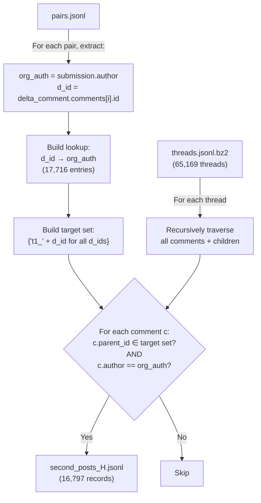
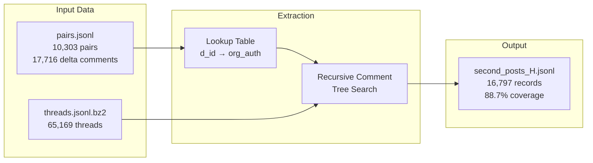

# Extracting 2nd Posts (H) from CMV Reddit Data

**Report Date:** July 10, 2026  
**Dataset:** r/ChangeMyView (CMV) Reddit Corpus  
**Output:** `second_posts_H.jsonl`

---

## 1. Objective

Extract the **Original Poster's (OP's) reply to a delta-awarded comment** — referred to as the **"2nd post H"** — from the ChangeMyView subreddit dataset.

In CMV, when a commenter successfully changes the OP's view, the OP awards them a **delta (∆)**. The 2nd post H is the OP's response where they acknowledge the view change, often explaining *why* and *how* their view was changed.

---

## 2. Input Data

### 2.1 `pairs.jsonl` (94.7 MB)

Each line is a JSON object representing a **(delta, no-delta) comment pair** for a given CMV submission.

| Field | Description |
|---|---|
| `submission` | The original CMV post (title, author, body, id, etc.) |
| `delta_comment` | A comment that **earned a delta** (changed OP's view) |
| `nodelta_comment` | A comment that **did not earn a delta** (contrasting example) |
| `comments_similarity` | Similarity score between the delta and no-delta comments |

**Statistics:**

| Metric | Count |
|---|---|
| Total pair records | 10,303 |
| Unique delta comment IDs | 17,716 |
| Unique submissions (CMV posts) | 5,990 |
| Unique OPs (original posters) | 4,895 |
| Unique delta comment authors | 4,763 |
| Unique no-delta comment authors | 5,142 |

> [!NOTE]
> A single pair record can contain multiple delta comments in the `delta_comment.comments` array. That's why 10,303 pair records yield 17,716 unique delta comment IDs.

**Delta comments per submission distribution:**

| Range | Count | Percentage |
|---|---|---|
| 1 delta comment | 2,372 | 39.6% |
| 2–5 delta comments | 2,920 | 48.7% |
| 6+ delta comments | 698 | 11.7% |
| **Average per submission** | **2.96** | — |
| **Maximum per submission** | **183** | — |


### 2.2 `threads.jsonl.bz2` (660.9 MB compressed)

Each line is a JSON object representing a **full Reddit thread** — the submission plus all comments as a nested tree.

| Metric | Count |
|---|---|
| Total threads | 65,169 |
| Threads matching a pairs submission | 5,990 (100% of pairs) |
| Threads with no corresponding pair | 59,179 |

> [!IMPORTANT]
> All 5,990 unique submissions from `pairs.jsonl` exist in `threads.jsonl` — there is a **100% match rate** between the two files. The remaining 59,179 threads are CMV posts where no delta was ever awarded.

---

## 3. Methodology

### 3.1 Reddit's Fullname System

Reddit uses type prefixes (called "fullnames") to identify objects:

| Prefix | Type | Example |
|---|---|---|
| `t1_` | Comment | `t1_cpumucv` |
| `t2_` | Account / Redditor | `t2_abc123` |
| `t3_` | Link / Submission (Post) | `t3_4p5d01` |
| `t4_` | Message | — |
| `t5_` | Subreddit | `t5_2w2s8` |
| `t6_` | Award / Trophy | — |

The `parent_id` field on a comment uses this system. If a comment's `parent_id` is `t1_xyz`, it means the comment is a **reply to comment `xyz`**. If it's `t3_xyz`, it's a **top-level reply to submission `xyz`**.

### 3.2 Extraction Algorithm



**Step-by-step:**

1. **Load `pairs.jsonl`**: For each pair, extract:
   - `org_auth` = `submission.author` (the original poster)
   - `d_id` = `delta_comment.comments[i].id` (the delta comment's ID, without prefix)

2. **Build lookup table**: Map each `d_id` → `org_auth` (17,716 entries)

3. **Build target parent IDs**: Create a set of `"t1_" + d_id` for all delta comment IDs. This is the fullname we expect to see as `parent_id` on the OP's reply.

4. **Scan `threads.jsonl.bz2`**: For each of the 65,169 threads, recursively traverse the entire comment tree (comments → children → children → ...). For each comment `c`, check:
   - `c.parent_id` ∈ target set? (Is this a reply to a delta comment?)
   - `c.author` == corresponding `org_auth`? (Was it written by the OP?)

5. **Output**: Write all matching comments to `second_posts_H.jsonl`.

### 3.3 Implementation

The extraction script is [extract_second_posts.py](file:///d:/NLI-RAG/extract_second_posts.py).

Key design decisions:
- **Recursive traversal**: Comments in `threads.jsonl` are nested (each comment has a `children` array). The script recursively searches all levels.
- **Set-based lookup**: Using Python sets for O(1) membership testing on 17,716 target parent IDs.
- **Streaming processing**: Reads threads line-by-line to avoid loading the entire 660MB+ dataset into memory.

---

## 4. Results

### 4.1 Output File: `second_posts_H.jsonl`

**Location:** [second_posts_H.jsonl](file:///d:/NLI-RAG/second_posts_H.jsonl) (11.9 MB, 16,797 records)

Each line is a JSON object with the following schema:

| Field | Type | Description |
|---|---|---|
| `comment_id` | string | Reddit ID of the OP's reply (the 2nd post H) |
| `author` | string | The original poster's username (`org_auth`) |
| `parent_id` | string | Fullname of the delta comment (`t1_` + `d_id`) |
| `d_id` | string | The delta comment ID this is a reply to |
| `body` | string | Full text of the OP's reply |
| `created_utc` | int/string | Unix timestamp of when the reply was posted |
| `link_id` | string | Fullname of the parent submission (`t3_...`) |
| `score` | int | Reddit score (upvotes − downvotes) |
| `subreddit` | string | Always `changemyview` |

### 4.2 Coverage Statistics

| Metric | Count | Percentage |
|---|---|---|
| Delta comment IDs searched for | 17,716 | 100% |
| Delta comments with OP reply found | 15,717 | 88.7% |
| Delta comments with **no** OP reply found | 1,999 | 11.3% |
| **Total 2nd posts (H) extracted** | **16,797** | — |

> [!NOTE]
> 16,797 > 15,717 because some delta comments received **multiple replies** from the OP (e.g., an initial discussion reply followed by a separate delta-awarding reply). On average, ~1.07 OP replies per matched delta comment.

### 4.3 Why 1,999 Delta Comments Have No Match

The 11.3% unmatched cases likely arise from:
- **Deleted replies**: The OP's reply was deleted by the user or moderators
- **Delta awarded elsewhere**: The OP awarded the delta in a deeper nested reply, not as a direct child of the delta comment
- **Author `[deleted]`**: The OP's account was deleted, making author matching impossible

### 4.4 Body Length Distribution

| Length Range | Count | Percentage | Description |
|---|---|---|---|
| < 50 chars | 696 | 4.1% | Very short / delta-only replies |
| 50–199 chars | 4,589 | 27.3% | Brief acknowledgements |
| 200–999 chars | 9,541 | 56.8% | **Substantive replies** explaining view change |
| 1,000+ chars | 1,971 | 11.7% | Detailed, in-depth responses |

| Statistic | Value |
|---|---|
| Average body length | 503 characters |
| Median body length | 317 characters |
| Minimum | 1 character |
| Maximum | 9,675 characters |

### 4.5 Delta Symbol Presence

| Contains ∆ / delta keyword | Count | Percentage |
|---|---|---|
| Yes | 10,234 | 60.9% |
| No | 6,563 | 39.1% |

> [!TIP]
> 39.1% of OP replies do **not** contain an explicit delta symbol. These are typically discussion replies where the OP engages with the delta comment's arguments but awards the delta in a separate comment.

### 4.6 Unique Participants

| Entity | Count |
|---|---|
| Unique OPs (original posters) | 4,895 |
| Unique CMV submissions represented | 5,990 |

---

## 5. Example Records

### Example 1: Substantive View Change
```json
{
  "comment_id": "cpuxduf",
  "author": "gobears10",
  "parent_id": "t1_cpumucv",
  "d_id": "cpumucv",
  "body": "∆\n\nYou are absolutely correct. I understand that I created
          a false dichotomy in my post. If I had to reword my title,
          I would argue that I specifically oppose the version of Basic
          Income as conceived by conservatives and right-libertarians.
          However, there is a more convincing case (in my view), for a
          left-libertarian version of BI that retains the progressive
          income tax. Thanks!",
  "created_utc": "1427670580",
  "link_id": "t3_30oi71",
  "score": 1,
  "subreddit": "changemyview"
}
```

### Example 2: Brief Acknowledgement
```json
{
  "comment_id": "d2gqzr2",
  "author": "TaslaVenhyle",
  "parent_id": "t1_d2goctk",
  "d_id": "d2goctk",
  "body": "Not perfectly alike, but I'm of the opinion that there can't
          really be much connection romantically between two people who
          would otherwise not be friends. I may be wrong on this too,
          but the explanation of how men and women fill in different
          roles definitely opens my eyes here. ∆",
  "created_utc": 1461604037,
  "link_id": "t3_4gdj35",
  "score": 1,
  "subreddit": "changemyview"
}
```

---

## 6. File Summary

| File | Size | Records | Description |
|---|---|---|---|
| [pairs.jsonl](file:///d:/NLI-RAG/pairs.jsonl) | 94.7 MB | 10,303 | Input: delta/no-delta comment pairs |
| [threads.jsonl.bz2](file:///d:/NLI-RAG/threads.jsonl.bz2) | 660.9 MB | 65,169 | Input: full CMV thread trees |
| [extract_second_posts.py](file:///d:/NLI-RAG/extract_second_posts.py) | 5 KB | — | Extraction script |
| [second_posts_H.jsonl](file:///d:/NLI-RAG/second_posts_H.jsonl) | 11.9 MB | 16,797 | **Output: 2nd posts (H)** |

---

## 7. Data Flow Diagram



---

*Script: [extract_second_posts.py](file:///d:/NLI-RAG/extract_second_posts.py) | Output: [second_posts_H.jsonl](file:///d:/NLI-RAG/second_posts_H.jsonl)*
